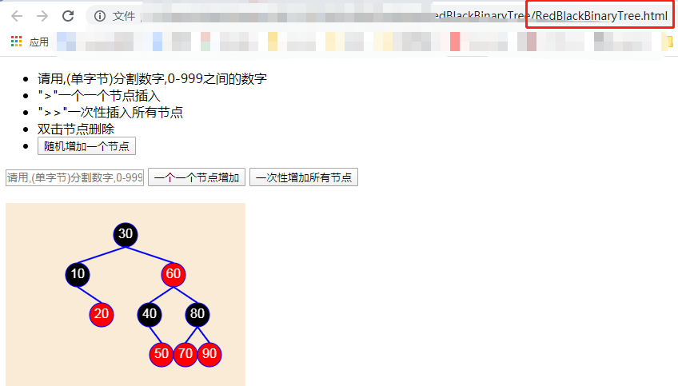

# redBlackTree
红黑树golang实现 和 演示用html工具

	代码参考：https://blog.csdn.net/happywjh666/article/details/51297942

	红色数性质
		1. 节点是红色或黑色。
		2. 根节点是黑色。
		3. 所有叶子都是黑色。（叶子是NUIL节点）
		4. 每个红色节点的两个子节点都是黑色。（从每个叶子到根的所有路径上不能有两个连续的红色节点）
		5. 从任一节点到其每个叶子的所有路径都包含相同数目的黑色节点。

